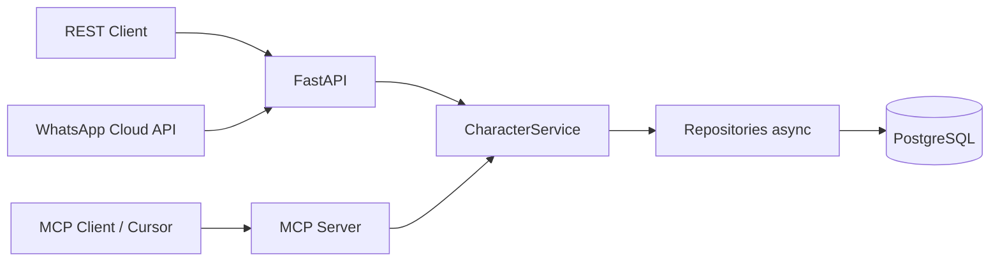

# FastAPI Character CRUD + OAuth2 + MCP

API REST para gestionar personajes (estilo Star Wars), con autenticación JWT, login OAuth2 (Google/GitHub) y un **servidor MCP** que expone el mismo CRUD reutilizando la capa de servicios.

El entorno de ejecución recomendado es **Docker Compose** (API, Postgres, tests y MCP). No necesitas un virtualenv local.

---

## Características

- **FastAPI** con OpenAPI en `/docs`
- **PostgreSQL** + **SQLAlchemy 2** (async) + **Alembic**
- **JWT** (signup/signin) y flujos **Google / GitHub OAuth**
- CRUD de **characters** con ownership (`user_id`)
- **MCP** (Model Context Protocol): tools `create_character`, `get_character`, `list_characters`, `update_character`, `delete_character`
- **WhatsApp** (Cloud API): webhook para manejar personajes por chat
- Inyección de dependencias con **dependency-injector**

---

## Arquitectura (resumen)

```text
app/api/endpoints/     → HTTP (FastAPI)
core/services/         → Lógica de aplicación
core/repository/       → Acceso a datos (async)
core/models/           → ORM SQLAlchemy
app/mcp/               → Servidor MCP (stdio / HTTP opcional)
```



La API y MCP comparten **base de datos** y **`CharacterService`**; no duplican reglas de negocio.

Ver [CHANGELOG.md](CHANGELOG.md) para el detalle de cambios recientes.

---

## Requisitos

- Docker Engine
- Docker Compose v2

---

## Inicio rápido

### 1. Variables de entorno

```bash
cp .env.example .env
```

Edita `.env` (sobre todo `SECRET_KEY` y OAuth si lo usas). Dentro de Compose, la API usa `POSTGRES_HOST=db`; mantén ese valor para los contenedores.

### 2. Levantar el stack

```bash
docker compose build
docker compose up
```

El contenedor `character`:

1. Espera a que Postgres esté healthy  
2. Ejecuta `alembic upgrade head`  
3. Arranca **uvicorn** con reload (target `dev`)

- API: [http://localhost:8000](http://localhost:8000)  
- Swagger: [http://localhost:8000/docs](http://localhost:8000/docs)  
- Postgres en el host: `localhost:5434` (puerto publicado por defecto)

### 3. Primer usuario y personaje (REST)

1. `POST /api/v1/auth/signup` con email, password, username, etc.  
2. `POST /api/v1/auth/signin` → copia `access_token`  
3. En Swagger, **Authorize** → `Bearer <token>`  
4. `POST /api/v1/characters` con name, height, mass, hair_color, skin_color, eye_color  
5. `GET /api/v1/characters` → solo personajes del usuario autenticado  

Anota el **`id`** del usuario (`GET /api/v1/users`) para MCP (`MCP_DEFAULT_USER_ID`).

### 4. Tests

```bash
make test
# o: docker compose exec character pytest -vv
```

### Makefile (atajos)

| Comando | Acción |
|---------|--------|
| `make up` | `docker compose up -d` |
| `make down` | Baja servicios |
| `make test` | Pytest en contenedor |
| `make migrate` | Alembic upgrade head |
| `make mcp` | MCP stdio (script Docker) |
| `make mcp-http` | Perfil MCP HTTP (puerto 8001) |
| `make ngrok` | Túnel HTTPS hacia la API (perfil `ngrok`, inspector en el puerto 4040) |

---

## Variables de entorno (`.env`)

| Variable | Descripción |
|----------|-------------|
| `ENV` | `dev` en local |
| `SECRET_KEY` | Firma JWT |
| `ENGINE`, `POSTGRES_*` | Conexión DB (`POSTGRES_HOST=db` en Compose) |
| `GOOGLE_*`, `GITHUB_*` | OAuth (opcional si solo usas signup/signin) |
| `FRONTEND_URL` | Redirect OAuth al front |
| `MCP_DEFAULT_USER_ID` | Usuario dueño por defecto en tools MCP |
| `BACKEND_CORS_ORIGINS` | Orígenes CORS (`*` o lista separada por comas) |
| `RATE_LIMIT_SIGNIN` | Límite en signup/signin (ej. `10/minute`) |
| `WHATSAPP_VERIFY_TOKEN` | Token de verificación del webhook de Meta |
| `WHATSAPP_APP_SECRET` | App secret para validar `X-Hub-Signature-256` |
| `WHATSAPP_ACCESS_TOKEN` | Token para enviar respuestas por la Cloud API |
| `WHATSAPP_PHONE_NUMBER_ID` | ID del número de WhatsApp Business |
| `WHATSAPP_DEFAULT_USER_ID` | Usuario único si el teléfono no está vinculado (opcional) |
| `LLM_API_KEY` | Clave para entender frases en WhatsApp (API compatible con OpenAI) |
| `LLM_MODEL` | Modelo de esa API (por defecto `gpt-4o-mini`) |
| `NGROK_AUTHTOKEN` | Token del agente ngrok (perfil `ngrok`) |
| `NGROK_URL` | URL reservada del túnel, por ejemplo `https://my-app.ngrok.app` (opcional) |

Plantilla completa: [`.env.example`](.env.example). Tras el primer `signup`, actualiza `MCP_DEFAULT_USER_ID` con el `id` de `GET /api/v1/users`.

**Puertos opcionales** (shell al ejecutar Compose):

- `API_PUBLISH_PORT` (default `8000`)
- `POSTGRES_PUBLISH_PORT` (default `5434`)
- `NGROK_INSPECT_PORT` (default `4040`)

---

## API (referencia breve)

Prefijo: `/api/v1`

| Área | Rutas |
|------|--------|
| Auth | `POST /auth/signup`, `POST /auth/signin`, OAuth Google/GitHub |
| Users | `GET /users/me`, `GET/PATCH/DELETE /users/{id}` (solo tu propio id) |
| Characters | `GET/POST /characters`, `GET/PATCH/DELETE /characters/{id}` (JWT) |
| WhatsApp | `GET/POST /webhooks/whatsapp` (Meta), `PUT/GET/DELETE /whatsapp/me` (JWT) |
| Health | `GET /health`, `GET /ready` (DB ping) |

Los personajes están **acotados al usuario autenticado**. PATCH admite **campos parciales** en users y characters.

---

## Migraciones

Generar revisión (con el stack arriba):

```bash
docker compose exec character alembic revision --autogenerate -m "descripcion"
docker compose exec character alembic upgrade head
```

En `docker compose up`, las migraciones se aplican solas si `RUN_MIGRATIONS=true` (default).

---

## Perfil producción (Compose)

Sin bind mount, usuario no root, sin reload, workers configurables:

```bash
docker compose --profile prod up --build character-prod db
```

Variables útiles: `UVICORN_WORKERS`, `UVICORN_RELOAD=false` (ya fijado en el servicio prod).

---

## WhatsApp

El webhook de la [WhatsApp Cloud API](https://developers.facebook.com/docs/whatsapp/cloud-api/guides/set-up-webhooks) es un proveedor de `MessagingService`. Los comandos y los vínculos con usuarios viven en `core/messaging` y en la tabla `messaging_contacts` (`provider` + `external_id`). Otro canal, por ejemplo Telegram, implementa el mismo contrato (`parse_inbound`, `send`, `normalize_external_id`) y llama al mismo `CharacterService`.

1. En local, el túnel publica la API. Poné `NGROK_AUTHTOKEN` en `.env` y levantá el perfil:

```bash
make ngrok
docker compose logs ngrok
```

El inspector queda en [http://localhost:4040](http://localhost:4040). En Meta for Developers, suscribí el callback  
`https://<subdominio>.ngrok-free.app/api/v1/webhooks/whatsapp`  
con el mismo valor que `WHATSAPP_VERIFY_TOKEN`. `NGROK_URL` fija un dominio reservado para que esa URL no cambie al reiniciar.
2. Completá `WHATSAPP_APP_SECRET`, `WHATSAPP_ACCESS_TOKEN` y `WHATSAPP_PHONE_NUMBER_ID`.
3. Con un JWT, vinculá tu teléfono (el mismo formato que envía Meta, con código de país):

```bash
curl -X PUT http://localhost:8000/api/v1/whatsapp/me \
  -H "Authorization: Bearer <token>" \
  -H "Content-Type: application/json" \
  -d '{"phone":"5491112345678"}'
```

Si no vinculás números, `WHATSAPP_DEFAULT_USER_ID` hace que **cualquier** chat opere como ese usuario. Sirve para una sola persona; en cuanto hay más, vinculá cada teléfono.

Comandos (también `ayuda`):

| Mensaje | Acción |
|---------|--------|
| `listar` | Lista tus personajes |
| `ver 12` | Detalle |
| `crear Luke Skywalker \| 172 \| 77 \| blond \| fair \| blue` | Alta |
| `actualizar 12 masa=80` | Cambio parcial |
| `eliminar 12` | Baja |

El alta y la actualización también aceptan varias líneas (`nombre:`, `altura:`, `masa:`, `pelo:`, `piel:`, `ojos:`).

Con `LLM_API_KEY` el chat entiende frases ("creá un personaje", "eliminá este") y ejecuta las mismas tools que el MCP (`list_characters`, `create_character`, `update_character`, `delete_character`, `get_character`). Sin esa clave siguen los comandos de la tabla.

Las respuestas son texto. La ficha de un personaje usa negrita de WhatsApp.

Los ids de mensaje se recuerdan en memoria del proceso. Con más de un worker de uvicorn, un reintento de Meta puede ejecutar el comando dos veces.

## Servidor MCP

MCP corre **dentro del contenedor `character`** (misma `.env` y `POSTGRES_HOST=db`).

### Tools

| Tool | Descripción |
|------|-------------|
| `create_character` | Crea personaje para `user_id` |
| `list_characters` | Lista por `user_id` |
| `get_character` | Detalle por id (solo dueño) |
| `update_character` | Actualiza (solo dueño) |
| `delete_character` | Elimina (solo dueño) |

Parámetro opcional **`user_id`** en cada tool; si falta, se usa **`MCP_DEFAULT_USER_ID`** del `.env`.

### Cursor

El repo incluye [`.cursor/mcp.json`](.cursor/mcp.json), que ejecuta [`scripts/mcp_cursor_docker.sh`](scripts/mcp_cursor_docker.sh) (resuelve la ruta del proyecto automáticamente).

1. `docker compose up -d`  
2. `MCP_DEFAULT_USER_ID` = id de usuario real  
3. Recarga MCP en Cursor  

### Probar MCP en terminal

```bash
docker compose up -d
./scripts/run_mcp.sh
```

Cliente de ejemplo (dentro del contenedor):

```bash
docker compose exec character python examples/mcp_client_example.py
```

**MCP HTTP (opcional):** `make mcp-http` o `docker compose --profile mcp up -d mcp-http` (puerto host `8001` por defecto).

Entrypoint alternativo: `python /app/mcp_server.py` en el contenedor.

### MCP — problemas frecuentes

| Síntoma | Qué hacer |
|---------|-----------|
| `No module named 'app'` | No uses `-m app.mcp.server` desde el host; usa Docker o `/app/mcp_server.py` en el contenedor |
| `LazyStandaloneCoroutine was cancelled` | Revisa logs MCP; suele ser caída al conectar DB o config incorrecta |
| MCP no ve la DB | Ejecuta MCP **en** el contenedor (`mcp.json` con `docker compose exec`) |
| Tools vacías / error de user | Crea usuario vía REST y fija `MCP_DEFAULT_USER_ID` |

Comprobación:

```bash
docker compose ps
docker compose exec -i character python /app/mcp_server.py
```

(debe quedar en espera, sin traceback)

---

## Red Docker antigua

Si aparece un error de red `character` con labels incorrectos:

```bash
docker compose down
docker network rm character 2>/dev/null || true
docker compose up --build
```

---

## Estructura del proyecto

```text
app/api/endpoints/     auth, users, characters
app/mcp/               bootstrap, tools, server
core/                  services, repositories, models, schemas
db/                    database async, migrations
main.py                FastAPI app
container.py           DI
docker-compose.yml
Dockerfile             targets dev | prod
mcp_server.py          entrypoint MCP (path absoluto en contenedor)
scripts/run_mcp.sh
tests/
```

---

## Licencia / boilerplate

Proyecto base **BoilerPlate** — adapta `SECRET_KEY`, credenciales OAuth y políticas de producción antes de desplegar.
